# 🔍 Sistema de Achados e Perdidos — Shopping Iguatemi Esplanada
## Projeto Acadêmico Desenvolvido no curso Técnico de Desenvolvimento de Sistemas no Senac Sorocaba
  
> **Um sistema desktop corporativo robusto para gerenciamento de custódia, triagem inteligente e conformidade de itens perdidos.**

> ⚠️ **Nota:** Todos os dados exibidos nas demonstrações do sistema são fictícios e gerados estritamente para fins acadêmicos.

---

## 📌 Visão Geral do Projeto

Este sistema foi projetado sob medida para solucionar um desafio logístico e tecnológico real do **Shopping Iguatemi**: centralizar a operação de achados e perdidos, mitigar falhas humanas no cruzamento de informações e garantir conformidade jurídica na destinação final de itens de alto valor. A solução elimina a dependência de planilhas paralelas e substitui sistemas legados defasados.

## 👥 Equipe de Desenvolvimento - _Atuação de Cada um durante o Desenvolvimento do Projeto_
* **[Victor Dutra](https://www.linkedin.com/in/victordutra-/)** — *Líder de Projeto (Product Owner) & Desenvolvedor Backend*
* **[João Souza](https://www.linkedin.com/in/joaovictorsouzadev/?locale=pt-BR)** — *Líder de Projeto (Scrum Master) & Desenvolvedor Backend*
* **[Bruna Fiusa](https://www.linkedin.com/in/bruna-fiusa/)** — *Desenvolvedora de Banco de Dados & DBA*
* **[Gabriel Themer](https://www.linkedin.com/in/gabrielthemer/)** — *Desenvolvedor Frontend / UX-UI*
* **[Danilo Almeida](https://www.linkedin.com/in/danilo-almeida-48a4502a6/)** — *Desenvolvedor Frontend / UX-UI*
* **[Felipe Amaral](https://www.linkedin.com/in/felipe-amaral44/)** — *Desenvolvedor Frontend / UX-UI*

---

## ⚡ Diferenciais Técnicos & Decisões de Arquitetura

Para garantir que o sistema fosse escalável, seguro e de fácil manutenção, implementamos padrões consolidados de mercado:

*   **Padrão DTO (Data Transfer Object):** Utilizado para desacoplar as entidades de persistência do banco de dados da camada de visualização (UI), otimizando o tráfego de dados e aumentando a segurança da aplicação.
*   **Persistência com JPA & Hibernate:** Mapeamento objeto-relacional (ORM) robusto, eliminando SQL acoplado e otimizando consultas complexas com relacionamentos *Lazy/Eager* carregados sob demanda.
*   **Controle de Acesso Baseado em Perfis (RBAC):** Separação estrita de funções entre administradores do shopping e operadores do balcão de atendimento.
*   **Identidade Visual Customizada (Custom UX):** Interface construída em JavaFX, estilizada com uma paleta de cores elegante (tons de verde-oliva, bege e dourado), proporcionando uma experiência de uso extremamente profissional e imersiva.

---

## 🛠️ Stacks Utilizadas

*   **Linguagem:** Java (JDK 21 + Apache Maven)
*   **Persistência & ORM:** Hibernate / JPA
*   **Banco de Dados:** MySQL
*   **Interface Gráfica:** JavaFX

---

## 💻 Demonstração Visual & Fluxos de Trabalho

Abaixo, detalhamos o fluxo operacional do sistema através das interfaces reais desenvolvidas.

---

### 🔐 1. Segurança e Controle de Acesso
A porta de entrada do sistema conta com autenticação segura e controle rígido de sessões por colaborador.

#### Tela de Login Institucional 
<p align="center">
  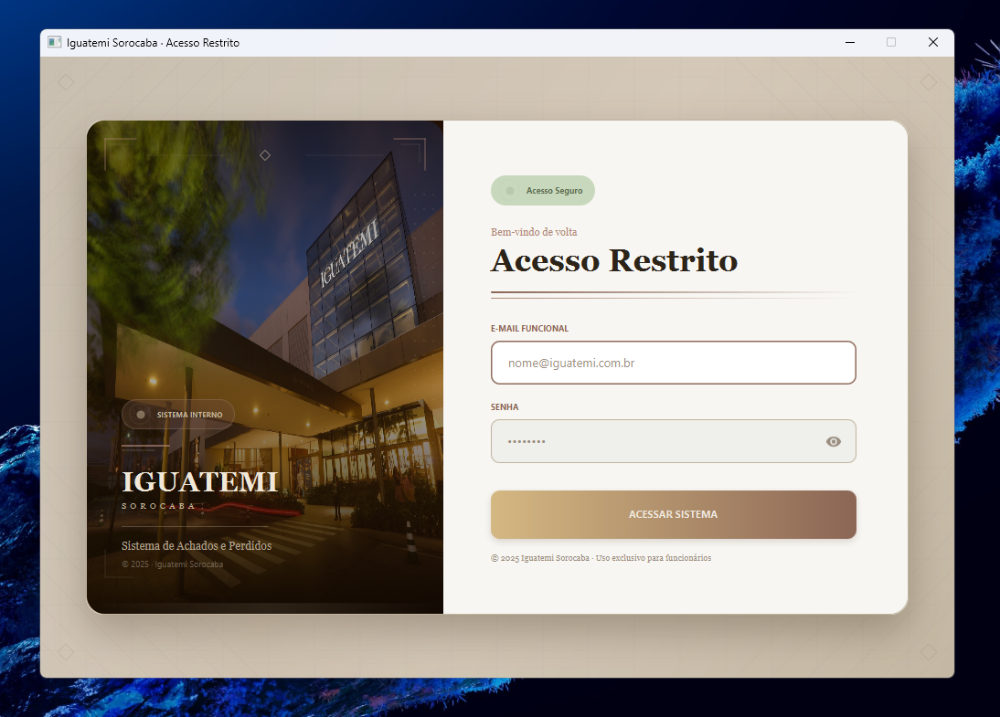
</p>

---

#### Gerenciamento Ativo de Colaboradores
<p align="center">
  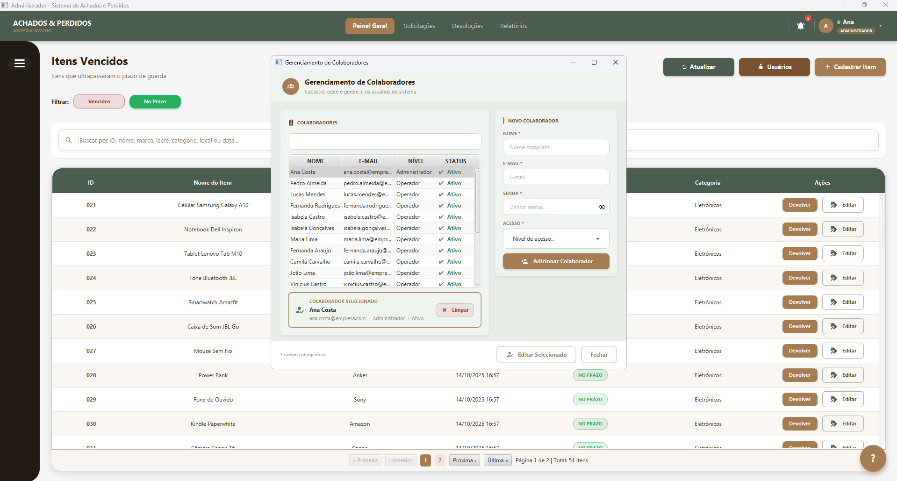
</p>

> 💡 *Interface customizada com controle de acesso restrito. Administradores gerenciam níveis de acesso de forma granular (Admin vs Operador).*

---

#### Demonstração em Execução (Fluxo de Login)
<p align="center">
  
</p>

---

### 📊 2. Dashboard Geral & Centralização de Alertas
O coração do sistema permite monitorar o inventário em tempo real e receber alertas críticos de conformidade de forma ativa.

#### Painel de Controle Principal (Inventário Ativo)
Centraliza todos os itens sob custódia, organizando-os por prazos legais de guarda (badges dinâmicos "No Prazo" e "Vencido").

#### Controle de Itens No Prazo
<p align="center">
  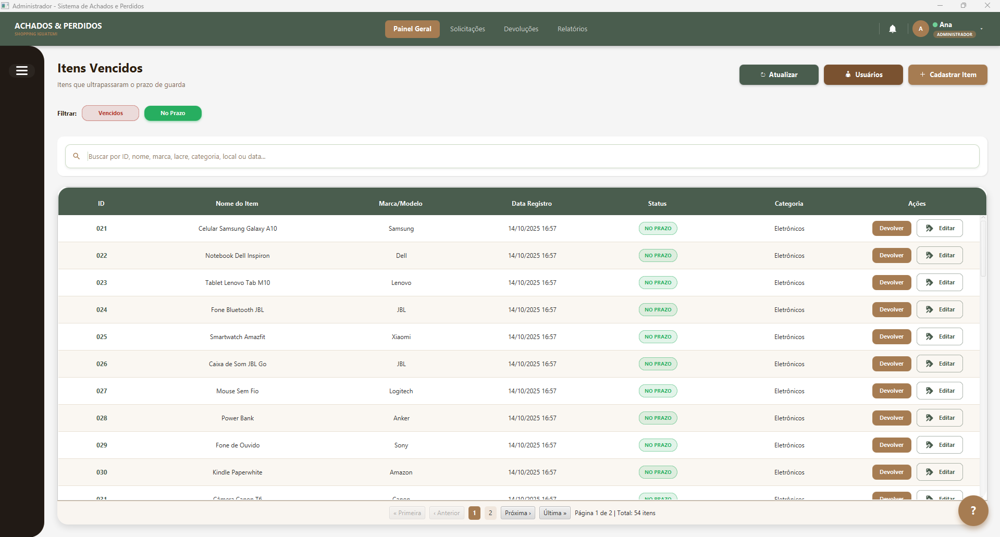
</p>

---

#### Controle de Itens Vencidos
<p align="center">
  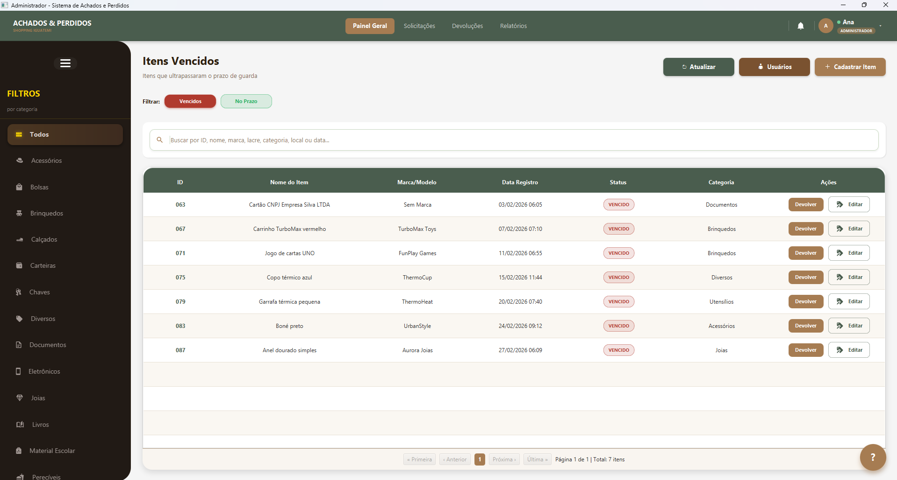
</p>

#### Central de Notificações Internas
Um sistema de push interno alerta o operador sobre inconsistências de cadastro, novas correspondências de itens ou prazos de descarte expirados.
<p align="center">
  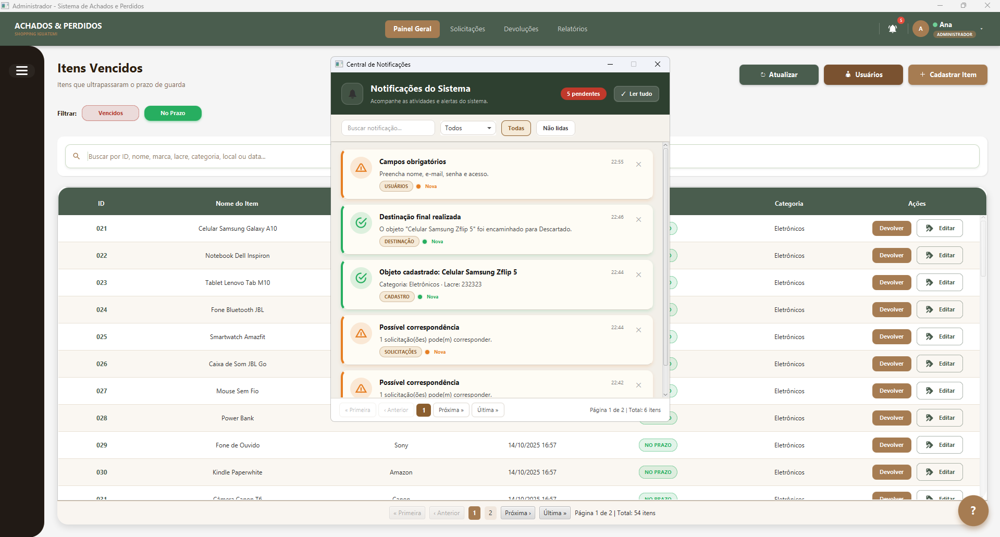
</p>

---

### 📥 3. Fluxo Inteligente de Entrada (Entrada de Itens e Busca)
Desenvolvemos uma mecânica inteligente para evitar duplicidade de registros e agilizar a localização de pertences de clientes.

#### Cadastro Inteligente com Busca por Correspondência (Match Automático)
Ao cadastrar um item novo (como o *Samsung Zflip 5* abaixo), o sistema executa um algoritmo em segundo plano que cruza categoria, marca e local com as solicitações abertas, alertando o operador imediatamente se o item já está no sistema para viabilizar a devolução de forma ágil.
<p align="center">
  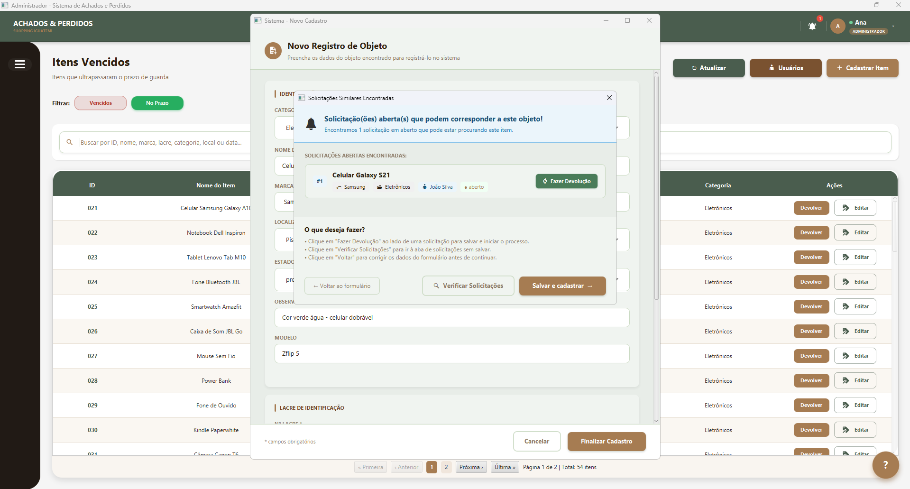
</p>

<details>
<summary>📂 Clique para expandir detalhes do fluxo de cadastro</summary>
<br>

#### Formulário de Cadastro de Objetos
Interface fluida para catalogar dados de lacre, estado físico ("Preservado", "Desgastado") e localização exata onde o objeto foi localizado.
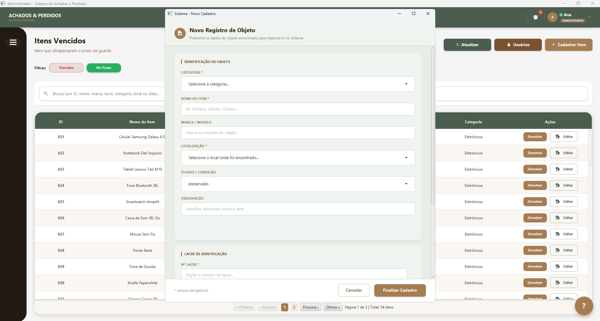

#### Registro de Nova Solicitação de Perda
Quando um cliente relata a perda de um objeto, o atendente preenche o formulário abaixo para registrar o alerta no banco.
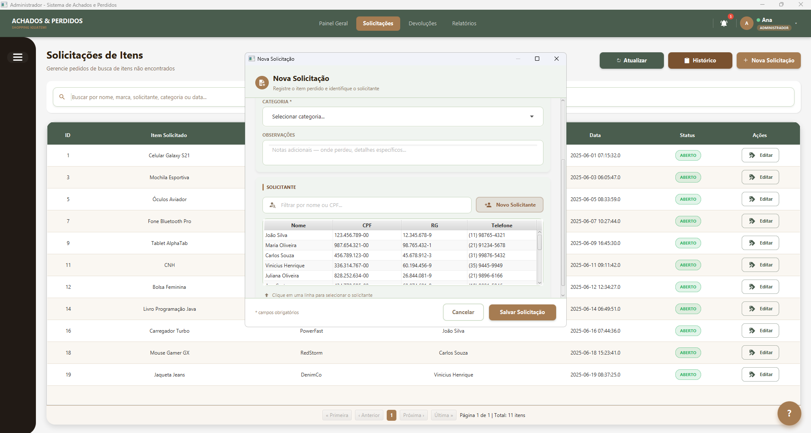

#### Modal de Cadastro de Solicitante
Cadastro rápido de dados pessoais de clientes integrado com máscaras de validação ativa (CPF, RG e Telefone).
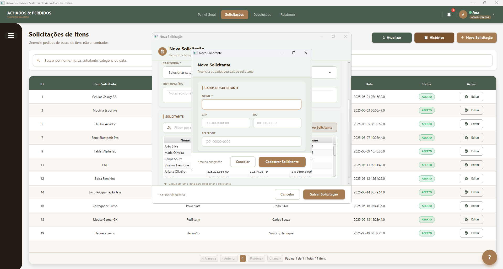

</details>

---

### 🤖 4. Assistência Operacional Interna (Chatbot)
Para acelerar o onboarding de funcionários temporários ou novos operadores, implementamos um **Assistente Virtual** diretamente na interface para guiar o fluxo operacional do sistema de forma dinâmica.
<p align="center">
  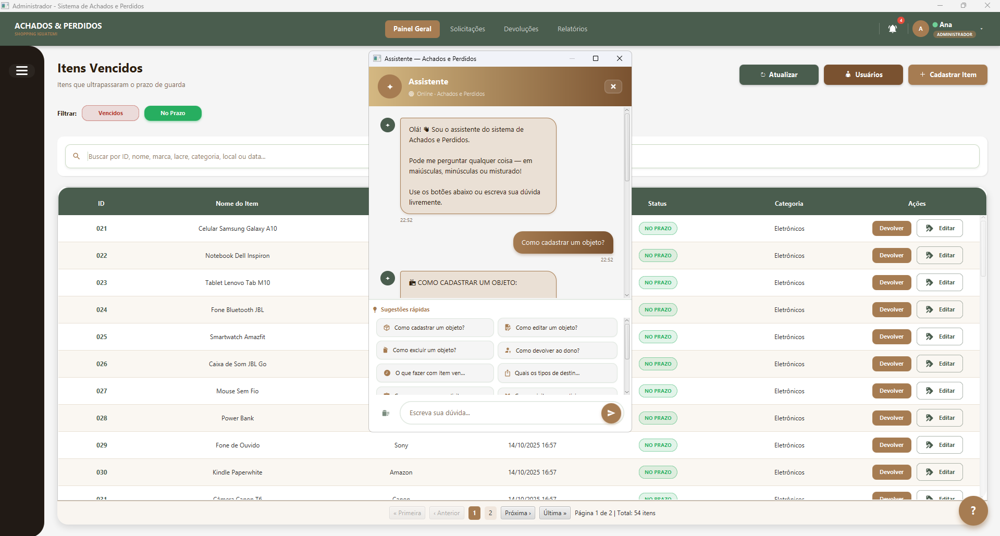
</p>

---

### 🔄 5. Fluxo de Saída Assistido (Devoluções e Descartes)
O processo de baixa exige segurança jurídica. Criamos um assistente guiado (*Wizard/Stepper*) que documenta perfeitamente o fim da custódia de cada objeto.

#### Triagem de Tipo de Destinação
O operador seleciona se o item voltará ao dono original ou se seguirá para destinação externa (Doações, Correios, Descarte/Incineração).
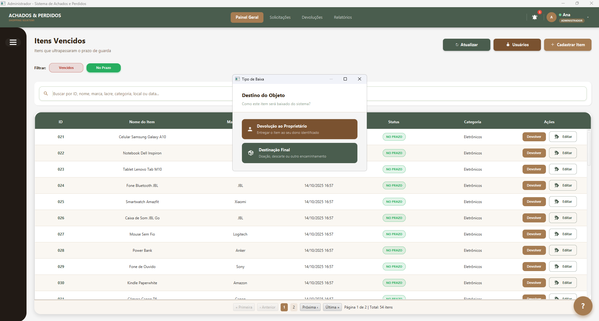

#### Módulo de Baixa Automatizado (Wizard Step-by-Step)
Fluxo em 4 etapas (Conferência ➔ Registro Fotográfico ➔ Seleção de Destino ➔ Revisão + Termo de Responsabilidade de Entrega com Assinatura) para blindar a operação contra erros processuais.
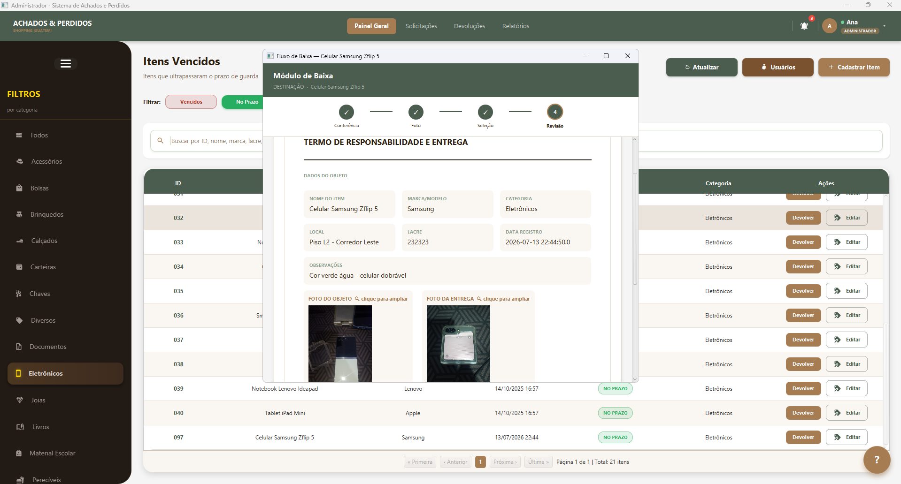

#### Tela de Auditoria: Itens Finalizados
Histórico completo de auditoria para rastrear o destino final de cada item de forma rápida e transparente.
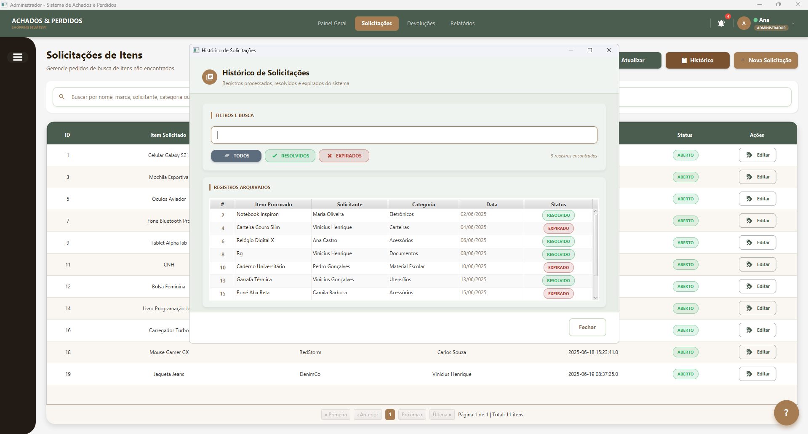

---

### 📈 6. Business Intelligence, Exportação e Relatórios Gerenciais
A gerência do shopping precisa de dados estatísticos para fins de auditoria e controle de perdas.

#### Painel de Análise Gerencial (Gráficos Nativos)
Exibe gráfico dinâmico de distribuição do resumo de lançamentos no sistema divididos de forma cronológica por Ano/Mês.
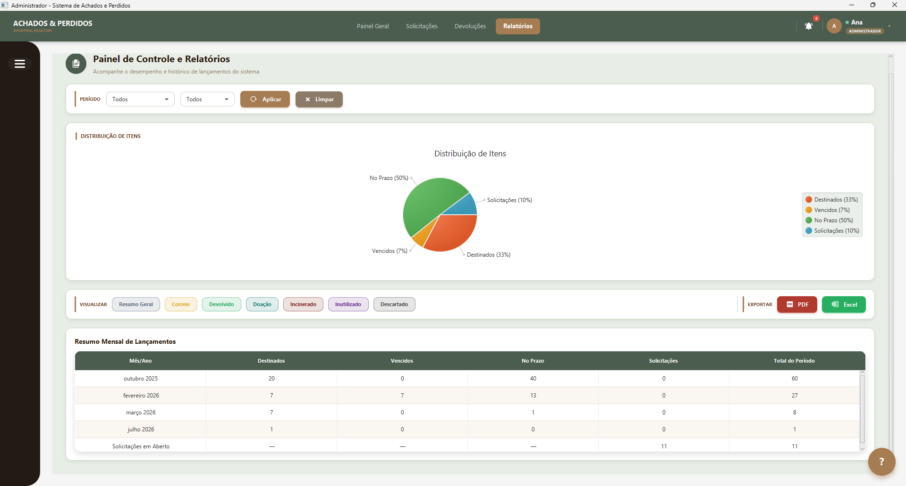

#### Geração de Termos de Entrega & Relatórios em PDF
O sistema exporta documentos formais como o **Termo de Responsabilidade** e "Resumos Executivos" consolidados com gráficos de distribuição para fins de auditoria interna.
<p align="center">
  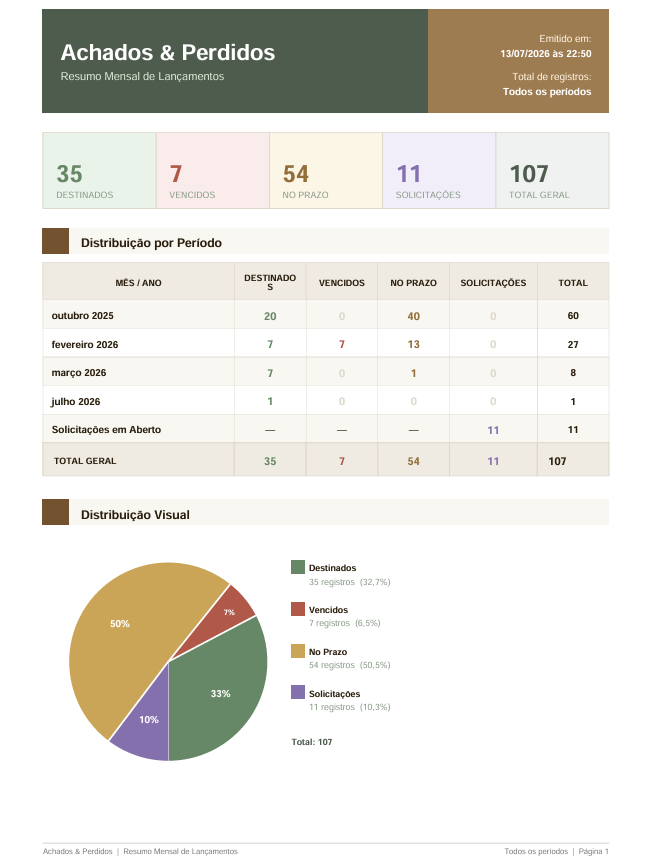
</p>

#### Exportação Direta para Planilhas Excel
Para que a contabilidade e diretoria possam trabalhar com os dados brutos, desenvolvemos a exportação direta do banco para arquivos `.xlsx` pré-estilizados e organizados por cor.
<p align="center">
  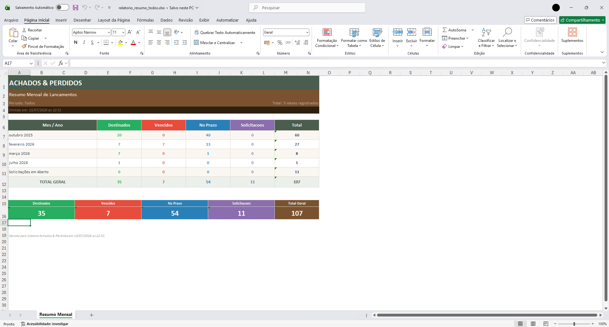
</p>

---

## 📁 Estrutura de Pastas do Repositório (Documentação Visual)

```bash
system-achados-perdidos-portfolio/
├── assets/                  # Todas as imagens e capturas de tela do sistema
└── README.md                # Este guia visual e técnico de portfólio
```
---

## ⚠️ Nota de Contexto e Isenção de Responsabilidade (Disclaimer)

*   **Validação de Requisitos e Papel de Liderança (PO/Scrum Master):** Este sistema foi concebido a partir de um processo real de descoberta de produto e levantamento de requisitos básicos realizado junto a representantes e colaboradores do **Shopping Iguatemi**. As etapas de escopo, negociação de funcionalidades e modelagem de regras de negócio envolveram rituais reais de desenvolvimento de software (justificando a atuação direta de *Product Owner* e *Scrum Master* na interface com o cliente).

*   **Independência do Software:** A aplicação contida neste repositório trata-se de uma **implementação técnica e acadêmica independente** desenvolvida pela equipe de desenvolvimento para o curso técnico do Senac. Este software específico não é oficialmente homologado, integrado, mantido ou patrocinado de forma ativa pelo Shopping Iguatemi.

*   **Dados Fictícios:** Para fins de conformidade com a LGPD (Lei Geral de Proteção de Dados) e segurança, todos os dados de clientes, funcionários, telefones e logs de auditoria exibidos nas capturas de tela e vídeos de demonstração são 100% fictícios e simulados localmente.

---

## ⚖️ Propriedade Intelectual & Direitos Autorais

Copyright © 2026 por Victor Dutra, João Souza, Bruna Fiusa, Gabriel Themer, Danilo Almeida e Felipe Amaral.  
**Todos os direitos reservados.**

Este repositório é estritamente para fins de **portfólio e demonstração técnica**. O código-fonte deste projeto é proprietário e mantido em um repositório privado. 

Nenhuma parte das interfaces visuais, fluxos de trabalho, textos ou mídias apresentados neste documento pode ser copiada, reproduzida, distribuída ou utilizada para engenharia reversa sem a autorização prévia por escrito dos detentores dos direitos autorais.
